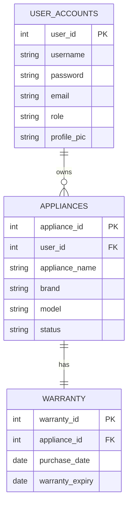

# Appliance Warranty Tracker Documentation

## 1. Project Context
The **Appliance Warranty Tracker** is a web-based application designed to help households and administrators manage and track the warranty status of various appliances. In many households, tracking warranty expiration dates for multiple devices (refrigerators, washing machines, TVs, etc.) is a manual and error-prone process, often leading to missed opportunities for service or replacement under warranty. This system centralizes this information, providing timely alerts and a clear overview of all assets.

## 2. General Objective
To develop a responsive and user-friendly web application that allows users to record, monitor, and manage the warranty details of their home appliances, ensuring they can maximize the benefits of their warrantees.

## 3. Specific Objectives
- To provide a secure login and registration system for users and administrators.
- To allow users to add, edit, and delete appliance records, including details like brand, model, purchase date, and warranty expiry.
- To display a dashboard with summary statistics (Total Appliances, Working, Broken, Expiring Soon, Expired).
- To implement an automated status tracking system that highlights appliances with expiring or expired warranties.
- To generate reports for administrators regarding user statistics and appliance statuses.

## 4. Scope and Limitations
**Scope:**
- **User Module:** 
    - User Registration and Authentication.
    - Dashboard view of appliance statuses.
    - Application management (CRUD operations).
    - Profile management (including profile picture).
- **Admin Module:**
    - Dashboard with system-wide analytics.
    - User management (view/delete users).
    - Appliance oversight.
    - Report generation.

**Limitations:**
- The system currently supports manual entry of appliance details; it does not automatically pull warranty info from manufacturer databases.
- Email notifications are dependent on the configuration of the local mail server/SMTP settings (currently configured for Gmail).

## 5. System Features

### User Features
- **Dashboard**: A comprehensive view showing the count of Total, Broken, Working, and Expired appliances.
- **Add Appliance**: A form to input appliance details (Name, Brand, Model, Purchase Date, Warranty Expiry).
- **My Appliances**: A list view of all registered appliances with status indicators (Active, Expired, Expiring Soon).
- **Profile Management**: Ability to update user details and upload a profile picture.

### Admin Features
- **Admin Dashboard**: Overview of total users, appliances, and warranty alerts across the system.
- **Analytics Charts**: Visual bar and pie charts showing user activity and appliance status distribution.
- **User Management**: Ability to monitor registered users.

## 6. System Analysis and Design

### ER Model (Entity-Relationship)


### Logical Model
- **User Entity**: Stores login credentials, roles, and profile info.
- **Appliance Entity**: Represents the physical item, linked to a User. Contains descriptive fields (Brand, Model).
- **Warranty Entity**: Contains the temporal data (dates) related to the Appliance. *Note: In some parts of the system, these dates are also denormalized into the Appliance records for easier querying.*

### Physical Database (SQL Script)
```sql
-- Database: appliance_warranty_system

SET SQL_MODE = "NO_AUTO_VALUE_ON_ZERO";
START TRANSACTION;
SET time_zone = "+00:00";

-- --------------------------------------------------------

-- Table structure for table `user_accounts`
CREATE TABLE `user_accounts` (
  `user_id` int(11) NOT NULL AUTO_INCREMENT,
  `username` varchar(50) NOT NULL,
  `password` varchar(255) NOT NULL,
  `email` varchar(100) NOT NULL,
  `role` enum('admin','user') DEFAULT 'user',
  `profile_pic` varchar(255) DEFAULT 'default_avatar.png',
  `active` tinyint(1) DEFAULT 1,
  `reset_token_hash` varchar(255) DEFAULT NULL,
  `reset_token_expires_at` datetime DEFAULT NULL,
  `created_at` timestamp DEFAULT CURRENT_TIMESTAMP,
  PRIMARY KEY (`user_id`),
  UNIQUE KEY `username` (`username`)
) ENGINE=InnoDB DEFAULT CHARSET=utf8mb4;

-- --------------------------------------------------------

-- Table structure for table `appliances`
CREATE TABLE `appliances` (
  `appliance_id` int(11) NOT NULL AUTO_INCREMENT,
  `user_id` int(11) NOT NULL,
  `appliance_name` varchar(100) NOT NULL,
  `brand` varchar(50) NOT NULL,
  `model` varchar(50) DEFAULT NULL,
  `status` enum('Working','Broken','Under Repair','Retired') DEFAULT 'Working',
  `purchase_date` date DEFAULT NULL, -- Redundant but present in some queries
  `warranty_expiry` date DEFAULT NULL, -- Redundant but present in some queries
  PRIMARY KEY (`appliance_id`),
  KEY `user_id` (`user_id`)
) ENGINE=InnoDB DEFAULT CHARSET=utf8mb4;

-- --------------------------------------------------------

-- Table structure for table `warranty`
CREATE TABLE `warranty` (
  `warranty_id` int(11) NOT NULL AUTO_INCREMENT,
  `appliance_id` int(11) NOT NULL,
  `purchase_date` date NOT NULL,
  `warranty_expiry` date NOT NULL,
  PRIMARY KEY (`warranty_id`),
  KEY `appliance_id` (`appliance_id`)
) ENGINE=InnoDB DEFAULT CHARSET=utf8mb4;

-- --------------------------------------------------------

-- Constraints
ALTER TABLE `appliances`
  ADD CONSTRAINT `appliances_ibfk_1` FOREIGN KEY (`user_id`) REFERENCES `user_accounts` (`user_id`) ON DELETE CASCADE;

ALTER TABLE `warranty`
  ADD CONSTRAINT `warranty_ibfk_1` FOREIGN KEY (`appliance_id`) REFERENCES `appliances` (`appliance_id`) ON DELETE CASCADE;

COMMIT;
```
